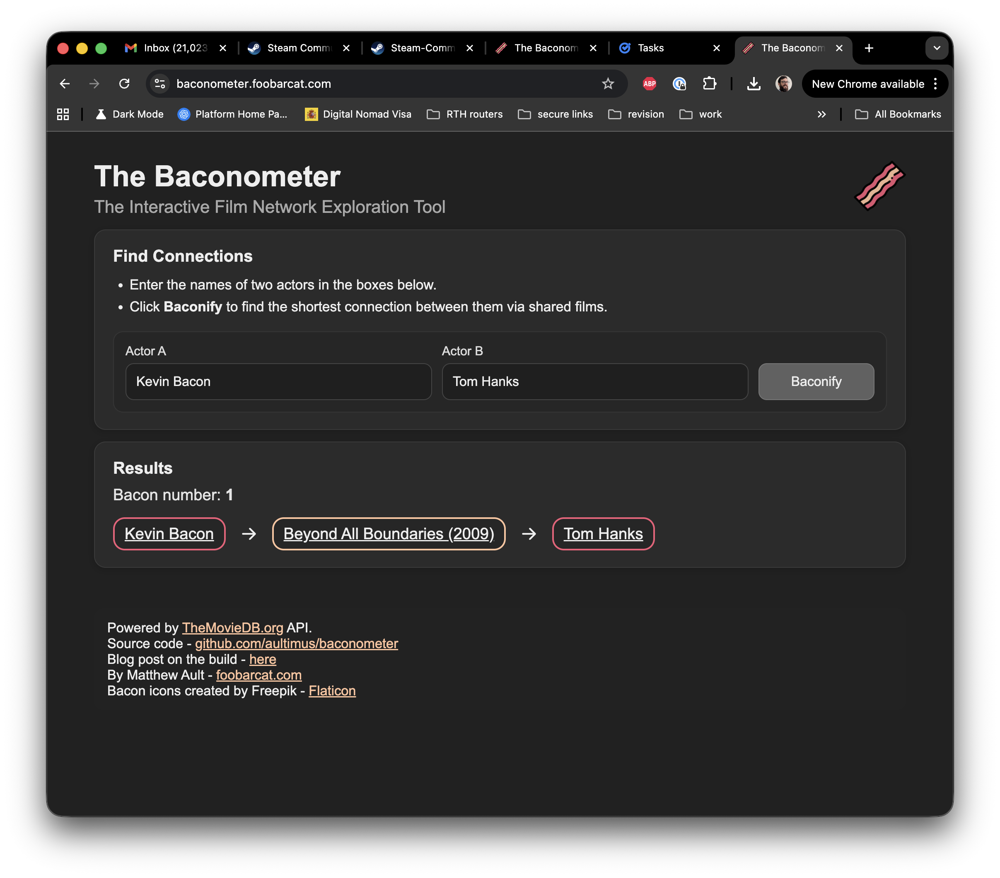

# Baconometer

This is a service that allows a user to find Bacon numbers.
A Bacon number is a measure of the "degrees of separation" between any actor and the actor Kevin Bacon, based on their appearances in films together. Specifically, an actor's Bacon number is defined as follows:

Kevin Bacon himself has a Bacon number of 0.
Any actor who has appeared in a film with Kevin Bacon has a Bacon number of 1.
Any actor who has not appeared with Kevin Bacon, but has appeared with someone who has, has a Bacon number of 2.
This pattern continues, with the Bacon number increasing by one for each additional degree of separation through shared film appearances.
The concept is based on the idea that any actor in the film industry can be linked to Kevin Bacon through a chain of co-starring roles, and is inspired by the "Six Degrees of Separation" theory. The lower an actor's Bacon number, the closer their connection to Kevin Bacon.

This service can be used to find the degrees of separation of any two actors, not just Kevin Bacon and another actor!

The service works by importing movie and actor data into a Neo4j graph database, where actors and films are represented as nodes connected by "acted in" relationships. When you search for a Bacon number or a connection between two actors, the service uses efficient graph algorithms to find the shortest path between them. The web frontend provides a simple interface for entering actor names and visualizing their connection path.

The Neo4j database is initialized using its native bulk import tool, which is much faster than inserting records one at a time. This step loads all nodes and relationships in a single operation, building indexes as specified.

The service indexes on a lower cased representation of names whilst displaying title case names to the user. This is in order to remove the need for case accurate user name entries, hence 'kevin bacon' is an acceptable input as is 'Kevin Bacon'. These indexes are used to look up the initial actors, then a breadth first search is performed from both actors to find a path between them, alternately traversing actor and film nodes.


## Dev setup

- `python -m venv .venv && . .venv/bin/activate ` - create and activate venv
- `make install` – Installs Python dependencies from `requirements.txt` (or via Poetry if configured) and creates `.venv` venv.
- `. .venv/bin/activate` – Activate venv. It is recommended to install [pyenv](https://github.com/pyenv/pyenv) to obviate the need for this step.

## Downloading and Preparing Data

You need to obtain data to run the service on. You have an option of running this service using either IMDB or TMDB data. Note, IMDB is only supported for *personal and non-commercial use only*.

### IMDB Data
IMDB data is downloadable *personal and non-commercial use only*, you should be aware of the strict copyright when using this data. You should not host a service serving this data, for that use case TMDB or Wikidata is more appropriate.

You should only need to do this once or whenever you want to load new data. The import is the really slow step, this initialises the neo4j database but takes around eight minutes to complete.

- `make download-imdb-data` – Downloads the IMDb dataset files (`name.basics.tsv.gz` and `title.basics.tsv.gz`) into the top-level directory.
- `make prepare-data` – Generates the Neo4j bulk import CSVs (`actors.csv`, `films.csv`, `acted_in.csv`).


### TMDB Data
Use `github.com/aultimus/tmdb-crawler` to obtain `actors.csv`, `films.csv` and `acted_in.csv`

### Importing Data

- `make import-data` – Runs the Neo4j bulk import step using Docker Compose. This loads the generated CSVs into a fresh Neo4j database. To run the bulk import manually (outside Docker), use `scripts/import_neo4j_bulk.sh`.

## Testing

This service has `unit tests`, `integration tests` and `system tests`.
Currently, you will need a neo4j database stood up and populated for both integration and system tests.
Additionally you will need the service stood up to run system tests.
TODO: seed a test db with test data.

- `make unit-tests` - Run locally, do not stand up an app, test parts of the code
- `make integration-tests` - Stand up the database, stands up the app within the same process as pytest. Allows for easier debugging but does not make actual http requests - they are in-process requests.
- `make system-tests` - Tests the actual built docker image that is running on the system. The tests are isolated from the test process. You can debug the tests in the same way in which you debug the running service when you launch under vscode.
- `make test` – Runs all test types

## Running

- `make up-dev` – Starts the full stack (Neo4j and your app) using Docker Compose.
- `make create-indexes` - Has to be ran whilst service is running after database has been recreated. You need to standup neo4j with the correct container name first (docker-compose up in another shell)

### Running in the Debugger (VS Code)

We recommend the following VS Code extensions:

- [Python](https://marketplace.visualstudio.com/items?itemName=ms-python.python)
- [Python Debugger](https://marketplace.visualstudio.com/items?itemName=ms-python.debugpy)
- [Pylance](https://marketplace.visualstudio.com/items?itemName=ms-python.vscode-pylance) 

1. Standup the database. Run `make run-neo4j`
2. Open the project folder in VS Code.
3. Go to the Run and Debug panel (play icon in the sidebar).
4. Select "Python: Debugger Flask" from the dropdown.
5. Click the green "Run" button or press F5.
6. Set breakpoints in your Python files as needed.

## Example usage

You can either use the Web front end or the JSON API.


### Web Frontend



### JSON API
```
(.venv) aulty@aulty-thinkpad:~/src/baconometer$ curl -s localhost:5000/bacon-number/Kevin%20Bacon/Tom%20Hanks | json_pp
{
   "bacon_number" : 2,
   "path" : [
      {
         "actor1" : "Kevin Bacon",
         "actor2" : "E. Scott Mayhugh",
         "film" : "Hollow Man"
      },
      {
         "actor1" : "E. Scott Mayhugh",
         "actor2" : "Tom Hanks",
         "film" : "Forrest Gump"
      }
   ]
}
```

## Debugging Neo4j

To debug the neo4j database, you can use the Neo4j Browser or cypher-shell:

**Using Neo4j Browser:**
1. Open [http://localhost:7474/](http://localhost:7474/) in your web browser.
2. Log in with your Neo4j username and password (default: `neo4j` / `neo4jtest123`).
3. Run commands, e.g.:
   ```
   SHOW INDEXES;
   ```

**Using cypher-shell from your host:**
```bash
cypher-shell -u neo4j -p neo4jtest123 -a bolt://localhost:7687 "SHOW INDEXES;"
```

**Using cypher-shell inside the container:**
```bash
docker compose exec neo4j cypher-shell -u neo4j -p neo4jtest123 "SHOW INDEXES;"
```

## Design Decisions
### Graph vs Relational DB
This project uses **Neo4j**, a graph database, instead of a traditional relational (SQL) database. This choice was driven by the nature of the data and the types of queries the application needs to perform.

---

### Data Model

The core of this project is representing **connections between actors through movies** (the classic "degrees of separation" or "Bacon Number"). This data is inherently a **network of relationships**, not just isolated rows.

- **Graph Databases** natively model entities and relationships:
  - Actors and movies are nodes.
  - "ACTED_IN" is an explicit relationship.
- **SQL Databases** require multiple join tables and foreign keys to express the same structure, leading to complex, slow joins for traversal.

---

### Query Patterns

Key queries in this project include:

- Finding the **shortest path** between two actors.
- Exploring all actors connected to a given actor within N degrees.
- Traversing large portions of the network efficiently.

These queries are:

**Trivial in Neo4j** using Cypher's `shortestPath()` or `variable-length pattern matching`.
**Complex and slow in SQL**, requiring recursive Common Table Expressions (CTEs) or application-level graph traversal logic.

---

### Performance

Graph databases are designed to:

- Traverse relationships in **constant time** regardless of overall dataset size.
- Avoid costly table scans and joins.
- Scale better for dense networks of interconnected data.

In SQL databases, even moderately complex traversal queries can degrade performance significantly as the data grows.

---

### Summary of Advantages

| Aspect             | Graph Database (Neo4j)                                    | SQL Database                                          |
|--------------------|-----------------------------------------------------------|-------------------------------------------------------|
| **Data model**     | Native nodes and relationships                           | Tables with foreign keys and join tables             |
| **Traversals**     | Efficient, built-in graph traversal algorithms           | Complex, often requiring recursive queries           |
| **Query language** | Cypher, optimized for graph patterns                     | SQL, optimized for tabular data                      |
| **Performance**    | Consistent traversal performance even at large scale     | Performance degrades with multiple joins and recursions |

---

### Conclusion

Given that this project is fundamentally about **exploring and analyzing connections between people**, a graph database was the natural choice. It provides:

- A more intuitive data model.
- Faster query performance for path finding.
- Simpler code and maintenance over time.

### Insert vs Bulk import

Neo4j supports two ways to load data:

- **Incremental Inserts**: Creating nodes and relationships one by one with Cypher (`CREATE`, `MERGE`).
- **Bulk Import**: Using `neo4j-admin import` to load large datasets from CSV files into a new database.

This project uses **bulk import** because:

- The initial dataset is large (many actors, movies, and relationships).
- Bulk import is much faster:
  - Processes all data in one pass.
  - Builds indexes efficiently.
  - Avoids transaction overhead.
- Incremental inserts are simpler for small updates but slow for big loads.

---

| Method               | Best For                         | Drawbacks                         |
|----------------------|----------------------------------|-----------------------------------|
| **Incremental Insert** | Small or frequent updates        | Slow for large initial datasets   |
| **Bulk Import**        | Initial bulk loading of data     | Requires empty database, offline |

---


Bulk import ensures the graph loads quickly and cleanly. After the initial load, any new data can be added incrementally as needed.


## Data Sources and Licensing

### Data Sources

This project provides an option to use the **IMDb dataset** for experimental purposes available at:

> https://datasets.imdbws.com/


**Important note:**
The IMDb data is provided for *personal and non-commercial use only*. Redistribution or public hosting of IMDb-derived data is prohibited by their terms. This repository **does not** contain IMDb data itself, only code to process data you download separately.

---

### IMDB Licensing Notice

The hosted version of this service does not use IMDB data in order to:
- Avoid licensing restrictions.
- Enable public hosting and sharing of the dataset.
- Ensure long-term sustainability.

---

### Comparison of Data Providers

| Feature                   | IMDb                                                | TMDb                                                | Wikidata                                       |
|---------------------------|-----------------------------------------------------|-----------------------------------------------------|-----------------------------------------------|
| **Coverage**              | Excellent (most comprehensive)                      | Very good, especially modern films and TV          | Mixed / inconsistent                         |
| **Data freshness**        | Excellent                                           | Excellent                                           | Varies                                       |
| **Access method**         | Static TSV dumps                                    | REST API                                           | SPARQL endpoint / RDF dump                   |
| **Licensing**             | Personal/non-commercial use only                    | Free (with attribution required)                  | Fully public domain (CC0)                    |
| **Redistribution**        | Not allowed without explicit permission             | Allowed if you attribute TMDb                      | Fully allowed                                |
| **Ease of use**           | Medium (requires TSV parsing and mapping)           | Easy (well-documented JSON API)                   | Medium-hard (SPARQL queries, data modeling) |
| **Media assets**          | Limited in dumps                                    | Rich metadata, posters, images                    | Few images                                   |
| **Data consistency**      | High                                                | High for modern data                              | Varies                                       |

---

### Current Status

At this time, the project uses IMDb solely for personal, non-commercial research. No IMDb data is redistributed or hosted as part of this repository.

We plan to transition to **TMDb** or **Wikidata** in the near future to ensure compliance with open data licensing and to enable public deployment.

---

### Contributing

If you have experience working with TMDb or Wikidata datasets and would like to help with the migration, contributions are welcome!


## Features to add
- Caching of results
- Map of an actor
- Wait for db to come up before fully initialising service
- Move off of Dev server
- Host
- Switch to poetry
- Support distinguishing between multiple actors with same name
- Add links to imdb/tmdb entries
- Optionally allow entering an imdb/tmdb actor id instead of a name
- Switch from IMDB to TMDB (better licensing and support). Add import abstraction layer so project can work with different datasets.
- Store and display year of the film
