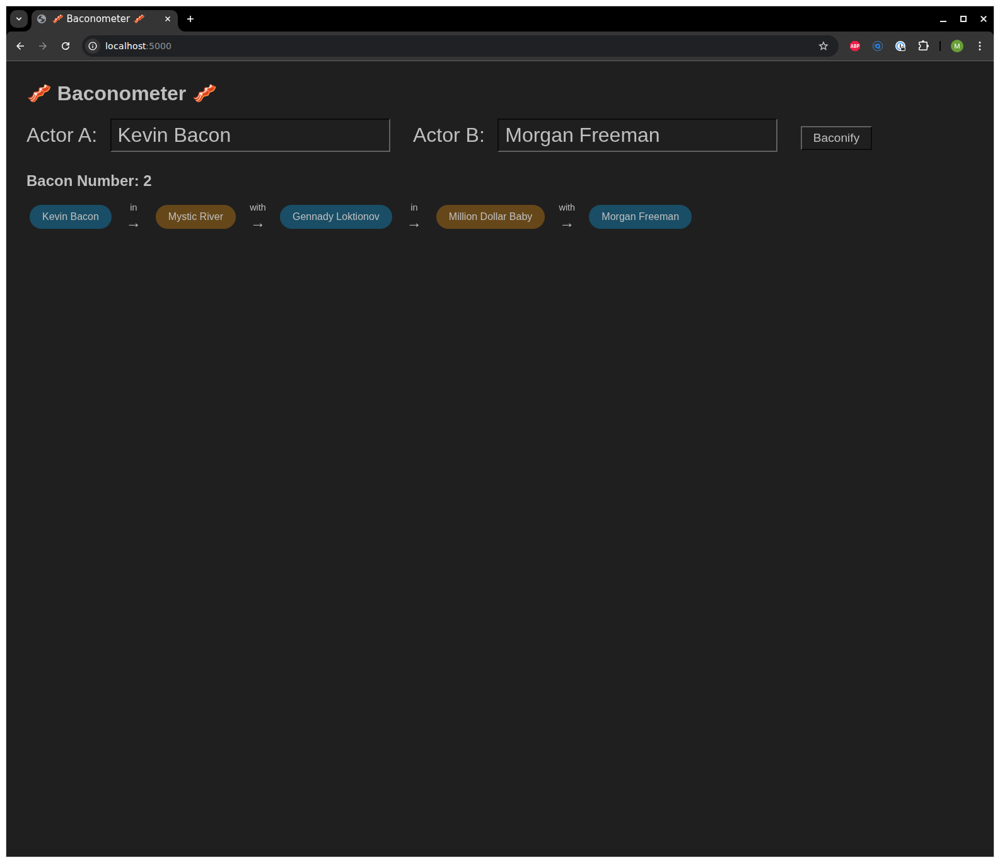

# Baconometer

This is a service that allows a user to find Bacon numbers.
A Bacon number is a measure of the "degrees of separation" between any actor and the actor Kevin Bacon, based on their appearances in films together. Specifically, an actor's Bacon number is defined as follows:

Kevin Bacon himself has a Bacon number of 0.
Any actor who has appeared in a film with Kevin Bacon has a Bacon number of 1.
Any actor who has not appeared with Kevin Bacon, but has appeared with someone who has, has a Bacon number of 2.
This pattern continues, with the Bacon number increasing by one for each additional degree of separation through shared film appearances.
The concept is based on the idea that any actor in the film industry can be linked to Kevin Bacon through a chain of co-starring roles, and is inspired by the "Six Degrees of Separation" theory. The lower an actor's Bacon number, the closer their connection to Kevin Bacon.

This service can be used to find the degrees of separation of any two actors, not just Kevin Bacon and another actor!

The service works by importing movie and actor data from IMDb into a Neo4j graph database, where actors and films are represented as nodes connected by "acted in" relationships. When you search for a Bacon number or a connection between two actors, the service uses efficient graph algorithms to find the shortest path between them. The web frontend provides a simple interface for entering actor names and visualizing their connection path.

The Neo4j database is initialized using its native bulk import tool, which is much faster than inserting records one at a time. This step loads all nodes and relationships in a single operation, building indexes as specified.

The service indexes on a lower cased representation of names whilst displaying title case names to the user. This is in order to remove the need for case accurate user name entries, hence 'kevin bacon' is an acceptable input as is 'Kevin Bacon'. These indexes are used to look up the initial actors, then a breadth first search is performed from both actors to find a path between them, alternately traversing actor and film nodes.


## Dev setup

- `python -m venv .venv && . .venv/bin/activate ` - create and activate venv
- `make install` – Installs Python dependencies from `requirements.txt` (or via Poetry if configured) and creates `.venv` venv.
- `. .venv/bin/activate` – Activate venv. It is recommended to install [pyenv](https://github.com/pyenv/pyenv) to obviate the need for this step.

## Downloading and Preparing Data

You should only need to do this once or whenever you want to load new data. The import is the really slow step, this initialises the neo4j database but takes around eight minutes to complete.

- `make download-data` – Downloads the IMDb dataset files (`name.basics.tsv.gz` and `title.basics.tsv.gz`) into the top-level directory.
- `make prepare-data` – Generates the Neo4j bulk import CSVs (`actors.csv`, `films.csv`, `acted_in.csv`).
- `make import-data` – Runs the Neo4j bulk import step using Docker Compose. This loads the generated CSVs into a fresh Neo4j database. To run the bulk import manually (outside Docker), use `scripts/import_neo4j_bulk.sh`.

## Testing

- `make test` – Runs the test suite using pytest with the correct import path setup.

## Running

- `make up-dev` – Starts the full stack (Neo4j and your app) using Docker Compose.
- `make create-indexes` - Has to be ran whilst service is running after database has been recreated.

### Running in the Debugger (VS Code)

We recommend the following VS Code extensions:

- [Python](https://marketplace.visualstudio.com/items?itemName=ms-python.python)
- [Python Debugger](https://marketplace.visualstudio.com/items?itemName=ms-python.debugpy)
- [Pylance](https://marketplace.visualstudio.com/items?itemName=ms-python.vscode-pylance) 

1. Standup the database. Run `make run-neo4j`
2. Open the project folder in VS Code.
3. Go to the Run and Debug panel (play icon in the sidebar).
4. Select "Python: Flask" from the dropdown.
5. Click the green "Run" button or press F5.
6. Set breakpoints in your Python files as needed.

## Example usage

You can either use the Web front end or the JSON API.


### Web Frontend



### JSON API
```
(.venv) aulty@aulty-thinkpad:~/src/baconometer$ curl -s localhost:5000/bacon-number/Kevin%20Bacon/Tom%20Hanks | json_pp
{
   "bacon_number" : 2,
   "path" : [
      {
         "actor1" : "Kevin Bacon",
         "actor2" : "E. Scott Mayhugh",
         "film" : "Hollow Man"
      },
      {
         "actor1" : "E. Scott Mayhugh",
         "actor2" : "Tom Hanks",
         "film" : "Forrest Gump"
      }
   ]
}
```

## Debugging Neo4j

To debug the neo4j database, you can use the Neo4j Browser or cypher-shell:

**Using Neo4j Browser:**
1. Open [http://localhost:7474/](http://localhost:7474/) in your web browser.
2. Log in with your Neo4j username and password (default: `neo4j` / `neo4jtest123`).
3. Run commands, e.g.:
   ```
   SHOW INDEXES;
   ```

**Using cypher-shell from your host:**
```bash
cypher-shell -u neo4j -p neo4jtest123 -a bolt://localhost:7687 "SHOW INDEXES;"
```

**Using cypher-shell inside the container:**
```bash
docker compose exec neo4j cypher-shell -u neo4j -p neo4jtest123 "SHOW INDEXES;"
```

## Design Decisions
### Graph vs Relational DB
TODO

### Insert vs Bulk import
TODO

## Features to add
- Caching of results
- Map of an actor
- Wait for db to come up before fully initialising service
- Move off of Dev server
- Host
- Switch to poetry
- Support distinguishing between multiple actors with same name
- Add links to imdb entries
